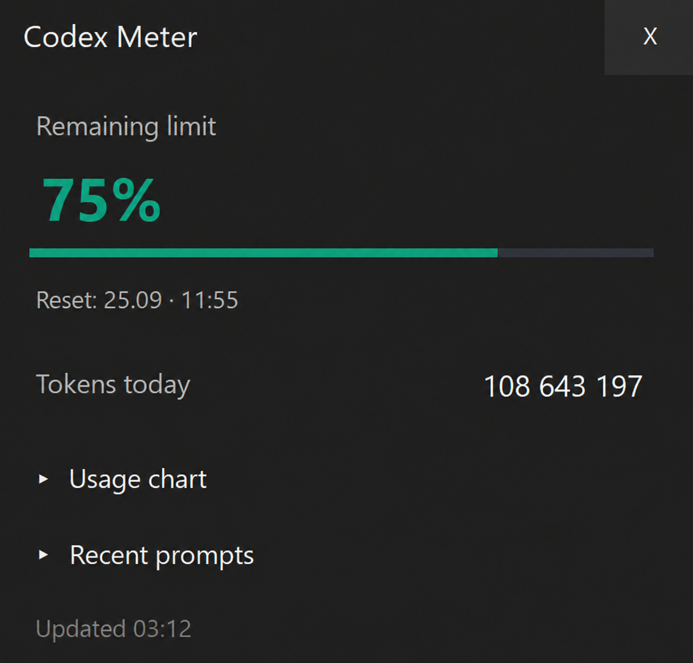

# Codex Meter

Windows application that displays Codex usage in a compact panel, on the taskbar and in the notification area.

The interface follows the Windows display language: Polish for Polish Windows, English for every other system language.

## Features

- Dynamic percentage meter on the taskbar and in the notification area.
- Remaining and used Codex limit with reset time.
- Local usage charts and recent prompt history.
- Completion notifications with input/output token counts, prompt, conversation, model and reasoning level.
- Polish interface with a tray-menu option that controls whether X minimizes to the taskbar or hides the panel to the notification area.

## Requirements

Windows 11 x64 and Codex installed and signed in. Codex Meter reads local Codex session data and the Codex app-server usage API. It does not require a Windows Widgets installation.

## What the numbers mean

Limits refer to Codex in a ChatGPT subscription, not all ChatGPT conversations. Charts aggregate local session token events, including repeated context and cached input. They are not prompt length, cost, or a percentage conversion. Exact remaining tokens are unavailable. Other devices are not included. See [Privacy](docs/PRIVACY.md).

Independent project, not affiliated with or endorsed by OpenAI or Microsoft.

## Development

Build: `dotnet build src/Meter/CodexMeter.csproj -c Release`

Microsoft sample-derived code retains MIT notices in `licenses/`.
